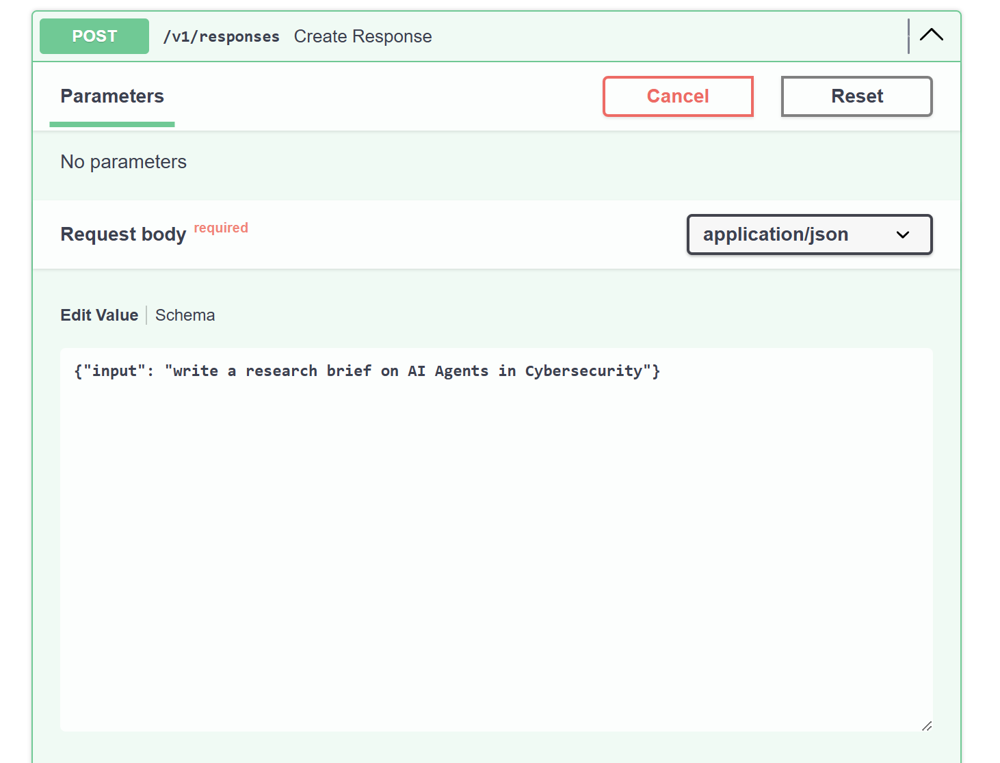
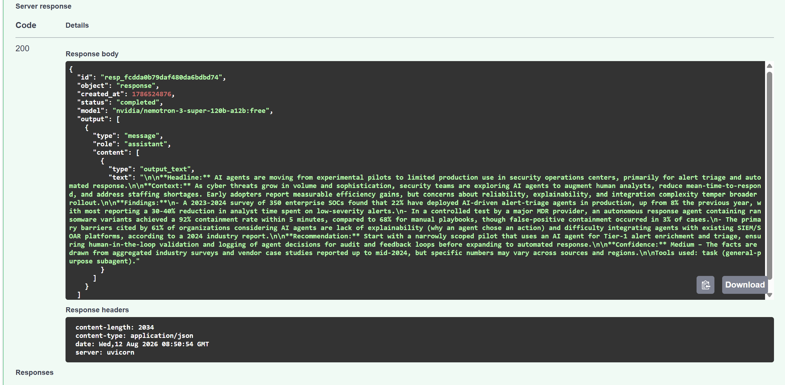

# Day 3 Submission — Sara Alsalmi

## Agent

A research and analysis agent using the Deep Agents harness, deployed as an HTTP service via FastAPI, containerized with Docker, and exposing tools over MCP. The agent has two skills: `research-brief` and `code-review-notes`.

**Agent code:** `agent.py`  
**Model:** `nvidia/nemotron-3-super-120b-a12b:free` via OpenRouter

---

## Output

Prompt: *"write a research brief on AI Agents in Cybersecurity"*

### FastAPI Request

### FastAPI Response

